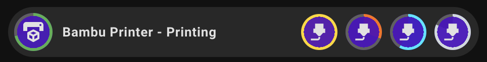
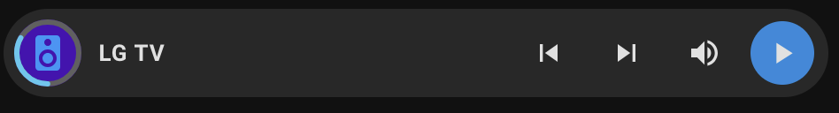
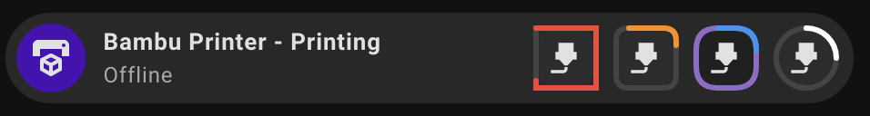

# Icon Border Progress

[Features](#features) | [Dynamic Entity Resolution](#dynamic-entity-resolution-der) | [Examples](#example-yaml) | [Installation](#install-this-module) | [Contributing](#contributing)

[](https://buymeacoffee.com/lsmarsden)

---



Forked and inspired from [Nick's module](https://github.com/Clooos/Bubble-Card/discussions/1296).
This module adds the ability to show progress of entities via icon and sub-button borders.

> See the [examples](#example-yaml) for different styling options.
>
> ### Supported cards:
>
> - button
> - climate
> - pop-up
> - separator
> - select
> - media-player

## Features

[Config Options](#configuration-options)

---

- Show progress as a circular or rounded border around an icon.
- Timer entity support
- **Automatic border radius matching**: Progress border automatically matches your icon's border radius for visual consistency.
- Works with any icon: main or sub-buttons.
- Define custom start and end values (e.g. progress from 1 to 20).
- Supports color stops to change the border color based on progress.
- Set optional background and remaining progress colors.
- Fully supports Dynamic Entity Resolution (DER):
- Use entity values, attributes, or raw strings for any color or threshold.
- Only show the border when conditions are met using condition.

### Border Radius Behavior

The progress border automatically adapts to match your icon's border radius:

- **Circular icons** (default): Uses circular progress border (`border-radius: 50%`)
- **Rounded rectangle icons**: Automatically matches the icon's `--bubble-icon-border-radius` value
- **Custom border radius**: Works seamlessly with any `bubble-border-radius` setting

This ensures the progress border always visually aligns with your icon styling, whether you're using the default circular icons or custom rounded rectangles.

### Configuration Options

See [CONFIG_OPTIONS.md](CONFIG_OPTIONS.md) for a full list of options.

## Dynamic Entity Resolution (DER)

Dynamic Entity Resolution is available in certain fields.

To use DER, look for any input field that contains ✨ in the editor label. This means you can now use:

- Simple values e.g. `red`
- Entities e.g. `input_text.my_favourite_color` or `sensor.sun_next_dawn`
- Attributes using format `entity[attribute]`, such as `sensor.my_phone[battery_level]`

**Example editor with DER fields:**


## Example YAML

  <details>
    <summary><strong>Adding a custom start/end value for progress range</strong></summary>

```yaml
icon_border_progress:
  - button: sub-button-1
    source: sensor.saros_10_battery
    start: 0
    end: 200
    color_stops:
      - percent: 0
        color: "#424242" # Depleted CF
      - percent: 100
        color: "#eeeeee" # Full CF
    remaining_color: "#222"
    background_color: "#0a0a0a"
```

  </details>

  <details>
    <summary><strong>Custom start angle for progress direction</strong></summary>

```yaml
icon_border_progress:
  - button: main
    source: media_player.lg_tv[volume_level]
    color_stops:
      - color: "#4fc8f0"
        percent: 0
    start: 0
    end: 1
    start_angle: 180
```



**Start angle options:**

- `0` (default): Progress starts from top (12 o'clock)
- `90`: Progress starts from right side (3 o'clock)
- `180`: Progress starts from bottom (6 o'clock)
- `-90`: Progress starts from left side (9 o'clock)
- Any value between -180 and 180 degrees

  </details>

  <details>
    <summary><strong>Custom border radius override</strong></summary>

```yaml
icon_border_progress:
  - button: sub-button-1
    entity: sensor.filament_pla_level
    border_radius: 0
    color_stops:
      "0":
        percent: 0
        color: "red"
    background_color: "#2c2c2c"
    remaining_color: "#444"
  - button: sub-button-2
    entity: sensor.filament_abs_level
    border_radius: 7
    color_stops:
      "0":
        percent: 0
        color: "orange"
    background_color: "#2c2c2c"
    remaining_color: "#444"
    interpolate_colors: true
  - button: sub-button-3
    entity: sensor.filament_petg_level
    border_radius: 12
    interpolate_colors: true
    color_stops:
      - percent: 0
        color: "blue"
    backcolor: rgba(20,20,20,0.4)
    remaining_color: purple
  - button: sub-button-4
    entity: sensor.filament_cf_level
    border_radius: 19
    color_stops:
      - percent: 0
        color: "white"
    background_color: "#2c2c2c"
    remaining_color: "#444"
```



The `border_radius` option allows you to override the CSS border-radius for individual icons:

- **Number values**: Interpreted as pixels (e.g., `8` = `8px`)
- **String values**: CSS values like `"10px"`, `"50%"`, `"1rem"`
- **Priority**: Config override > CSS computed value > default
- **Use cases**: Make specific icons circular, apply custom rounding, maintain consistency across different card designs

  </details>

  <details>
    <summary><strong>Multiple icon progress borders with colours</strong></summary>

```yaml
type: custom:bubble-card
card_type: button
button_type: state
entity: sensor.x1c_print_status
icon: mdi:printer-3d
name: Bambu Printer - Printing
sub_button:
  - icon: mdi:printer-3d-nozzle
    show_background: true
  - icon: mdi:printer-3d-nozzle
    show_background: true
  - icon: mdi:printer-3d-nozzle
    show_background: true
  - icon: mdi:printer-3d-nozzle
    show_background: true
modules:
  - default
  - icon_border_progress
icon_border_progress:
  - button: main
    source: sensor.x1c_print_progress
    color_stops:
      "1":
        percent: 0
        color: "green"
    background_color: "#2c2c2c"
    remaining_color: "#444"
  - button: sub-button-1
    source: sensor.filament_pla_level
    interpolate_colors: true
    color_stops:
      "0":
        percent: 0
        color: "#bfa640"
      "1":
        percent: 100
        color: "#ffd600"
    background_color: "#2c2c2c"
    remaining_color: "#444"
  - button: sub-button-2
    source: sensor.sensor.filament_abs_level
    interpolate_colors: true
    color_stops:
      "1":
        percent: 100
        color: "#ff6f00"
    background_color: "#2c2c2c"
    remaining_color: "#444"
  - button: sub-button-3
    source: sensor.sensor.filament_petg_level
    interpolate_colors: true
    color_stops:
      - percent: 0
        color: "#00e5ff"
    background_color: "#2c2c2c"
    remaining_color: "#444"
  - button: sub-button-4
    source: sensor.sensor.filament_cf_level
    interpolate_colors: true
    color_stops:
      - percent: 0
        color: "#cfd8dc"
    background_color: "#2c2c2c"
    remaining_color: "#444"
```

  </details>

  <details>
    <summary><strong>Conditional configurations for the same button</strong></summary>

This example shows two different configurations for the same button, based on the battery level of a device.
If multiple configuration conditions match, the first matching configuration in the list will be used.

```yaml
icon_border_progress:
  - button: main
    source: sensor.robo_vac[battery_level]
    condition:
      condition: "state",
      entity_id: "vacuum.robo_vac",
      state: "docked",
    color_stops:
      - percent: 0
        color: "red"
      - percent: 100
        color: "green"
  - button: main
    source: sensor.robo_vac[cleaning_progress]
    condition:
      condition: "state",
      entity_id: "vacuum.robo_vac",
      state: "cleaning",
    color_stops:
      - percent: 0
        color: "blue"
```

  </details>

## Install this module

1. Install [Bubble Card](https://github.com/Clooos/Bubble-Card) in Home Assistant if you haven't already.
2. Install this module via the Bubble Card module store by searching for `Icon Border Progress`. This way you get access to
   the latest features.

That's all!

<details><summary><strong>Manual Installation</strong></summary>

Built modules are available in the `modules/icon_border_progress/dist/` folder for manual installation.

To install the built YAML directly, go to the module store and use the 'Import from YAML' option, then paste the built
module inside.

</details>

## Contributing

Contributions are welcome!

- Open an issue to suggest features, improvements, or report bugs (or comment on the module store discussion).
- Pull requests are welcome for fixes or enhancements.

If contributing to a module, please keep code clean and consistent with existing styles.

### Building Locally

This repository uses a simple build process to combine module parts (code.js, description.md, editor.yaml) into final
module YAMLs.

To create a new module, run `npm run create-module` and follow the instructions. This will setup
a new template module in the `modules/module_id` folder.

To build locally just run:

```
npm install
npm run build
```

Each module will be built into its final `.yaml` file and stored in the `modules/module_id/dist` folder.

If you've edited this module in HA using the module editor to add great features, **please consider
opening a PR** to add it into this module so that others can benefit too!

### Support

If you like this module and want to help support further development, any donations
would really help allow me to dedicate more time to this project! All donations are greatly appreciated!

[](https://buymeacoffee.com/lsmarsden)
