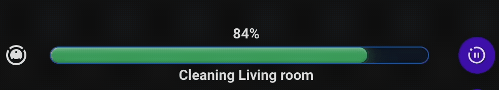

# Separator As Progress Bar

[Features](#features) | [Dynamic Entity Resolution](#dynamic-entity-resolution-der) | [Examples](#example-yaml) | [Installation](#install-this-module) | [Contributing](#contributing)

[](https://buymeacoffee.com/lsmarsden)

---




This module transforms the standard separator line into a sleek, customisable progress
bar with multiple styling and animation options.

> See the [examples](#example-yaml) for different styling options.
>
> ### Supported cards:
>
> - separator

## Features

[Config Options](#configuration-options)

---

- Bind to any numeric entity or attribute as the source for progress
- Define progress colors at specific percentage stops, with optional smooth interpolation between them
- Fully customizable progress bar appearance: height, outline, background, and color transitions
- Support for conditional and templated text above and below the progress bar using entity values
- Optional animated orb and/or shine effects, each fully customizable and independently toggleable by
  conditions
- Invert progress direction (e.g. countdown behavior)

### Configuration Options

See [CONFIG_OPTIONS.md](CONFIG_OPTIONS.md) for a full list of options.

## Dynamic Entity Resolution (DER)

Dynamic Entity Resolution is available in certain fields.

To use DER, look for any input field that contains ✨ in the editor label. This means you can now use:

- Simple values e.g. `red`
- Entities e.g. `input_text.my_favourite_color` or `sensor.sun_next_dawn`
- Attributes using format `entity[attribute]`, such as `sensor.my_phone[battery_level]`

**Example editor with DER fields:**


## Example YAML

  <details>
    <summary><strong>Minimal example</strong></summary>

```yaml
separator_as_progress_bar:
  source: sensor.task_progress
  progress_style:
    height: 12
    color_stops:
      - color: "#42a5f5"
        percent: 0
```

</details>

  <details>
    <summary><strong>Interpolated Gradients</strong></summary>
   <p>This example defines set colours at certain values, and interpolation will
gradually blend colours from one to another as the percentage increases.</p>

```yaml
separator_as_progress_bar:
  source: sensor.download_progress
  progress_style:
    height: 14
    interpolate: true
    color_stops:
      - color: red
        percent: 0
      - color: orange
        percent: 50
      - color: green
        percent: 100
```

</details>

  <details>
    <summary><strong>Orb animation</strong></summary>

```yaml
separator_as_progress_bar:
  source: sensor.vacuum_progress
  progress_style:
    height: 14
    color_stops:
      - color: darkblue
        percent: 0
    orb_settings:
      show_orb: true
      slow_orb: true
      orb_color: "#00e5ff"
      trail_color: "#00acc1"
      condition:
        condition: numeric_state
        entity: sensor.vacuum_progress
        above: 20
```

</details>

<details>
    <summary><strong>Shine animation</strong></summary>

```yaml
separator_as_progress_bar:
  source: sensor.cpu_load
  progress_style:
    height: 16
    color_stops:
      - color: "#81d4fa"
        percent: 0
      - color: yellow
        percent: 70
      - color: red
        percent: 100
    shine_settings:
      show_shine: true
      shine_color: "#ffffff"
      shine_angle: 30
      shine_delay: 0.5
      condition:
        condition: numeric_state
        entity: sensor.cpu_load
        below: 30
```

</details><details>
    <summary><strong>Text templates above/below</strong></summary>

```yaml
separator_as_progress_bar:
  source: sensor.washing_machine_progress
  progress_style:
    height: 16
    color_stops:
      - color: "#4caf50"
        percent: 100
  above_text:
    text: Washing in progress
    condition:
      condition: state
      entity: sensor.washer_status
      state: running
  below_text:
    text: "{pct}%"
    placeholders:
      pct: sensor.washing_machine_progress
```

</details>

<details>
    <summary><strong>Full configuration with animations and text</strong></summary>

```yaml
separator_as_progress_bar:
  source: sensor.saros_10_cleaning_progress
  invert: false
  progress_style:
    orb_settings:
      show_orb: true
      slow_orb: true
      orb_color: "#00e5ff"
      trail_color: transparent
      condition:
        condition: numeric_state
        entity: sensor.saros_10_cleaning_progress
        above: 60
    shine_settings:
      show_shine: true
      shine_color: "#64b5f6"
      shine_angle: -30
      shine_delay: 1
      condition:
        condition: numeric_state
        entity: sensor.saros_10_cleaning_progress
        below: 20
    outline:
      style: solid
      color: "#1565c0"
      width: 1
    height: 15
    interpolate: true
    background_color_stops:
      - color: "#0d1b2a"
        percent: 0
    color_stops:
      - color: "#1976d2"
        percent: 0
      - color: green
        percent: 100
  below_text:
    text: Cleaning {room}
    placeholders:
      room: sensor.saros_10_current_room
    condition:
      condition: state
      entity: sensor.saros_10_status
      state: cleaning
  above_text:
    placeholders:
      pct: sensor.saros_10_cleaning_progress
    text: "{pct}%"
```

</details>

## Install this module

1. Install [Bubble Card](https://github.com/Clooos/Bubble-Card) in Home Assistant if you haven't already.
2. Install this module via the Bubble Card module store by searching for `Separator As Progress Bar`. This way you get
   access to
   the latest features.

That's all!

<details><summary><strong>Manual Installation</strong></summary>

Built modules are available in the `modules/separator_as_progress_bar/dist/` folder for manual installation.

To install the built YAML directly, go to the module store and use the 'Import from YAML' option, then paste the built
module inside.

</details>

## Contributing

Contributions are welcome!

- Open an issue to suggest features, improvements, or report bugs (or comment on the module store discussion).
- Pull requests are welcome for fixes or enhancements.

If contributing to a module, please keep code clean and consistent with existing styles.

### Building Locally

This repository uses a simple build process to combine module parts (code.js, description.md, editor.yaml) into final
module YAMLs.

To create a new module, run `npm run create-module` and follow the instructions. This will setup
a new template module in the `modules/module_id` folder.

To build locally just run:

```
npm install
npm run build
```

Each module will be built into its final `.yaml` file and stored in the `modules/module_id/dist` folder.

If you've edited this module in HA using the module editor to add great features, **please consider
opening a PR** to add it into this module so that others can benefit too!

### Support

If you like this module and want to help support further development, any donations
would really help allow me to dedicate more time to this project! All donations are greatly appreciated!

[](https://buymeacoffee.com/lsmarsden)
