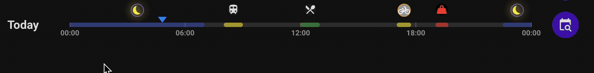
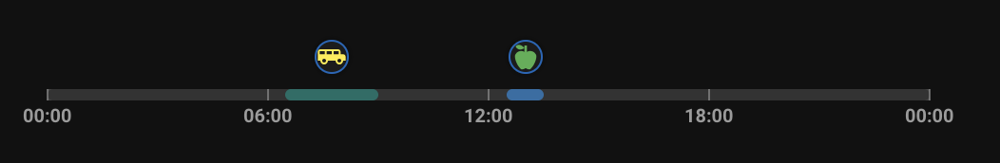
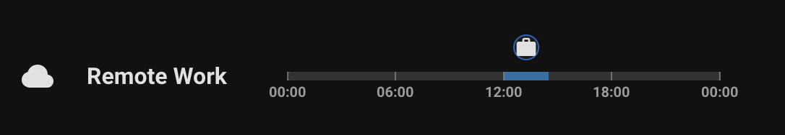
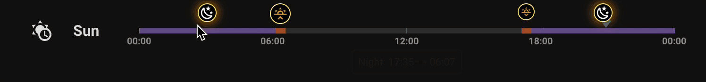
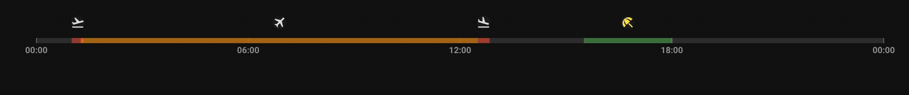
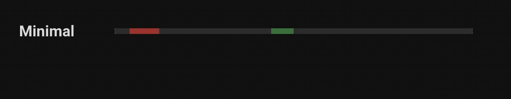
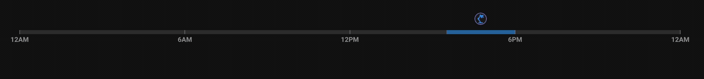

# Separator as Timeline

[Features](#features) | [Examples](#example-yaml) | [Installation](#install-this-module) | [Contributing](#contributing)

[](https://buymeacoffee.com/lsmarsden)

---



Transform any separator into a visual time-aware timeline.  
This module displays time blocks along the bar using flexible ranges, icons, labels, active indicators, and more.  
Use it for schedules, quiet hours, cleaning periods, charging windows - or anything time-related.

> See the [examples](#example-yaml) for different styling options.
>
> ### Supported cards:
>
> - Separator

## Features

[Config Options](#configuration-options)

---

- Define multiple time ranges using dynamic `start`/`end` entities (including `sensor`/`time`), attributes or static times
- Wraparound time support (e.g. `22:00 → 06:00`)
- Per-range labels and icons (with highlight when active)
- Group ranges by label to share highlighting
- Tooltip on hover with range label and time
- Optional tick marks at standard intervals (0:00, 6:00, etc.)
- Customisable time formatting including 12- and 24-hour, AM/PM suffixes
- Current time marker with color customization
- Rounded or flat segment edges (with logic for midnight cutoffs)
- Global or per-range styling for icon color, background, outline, glow
- Supports ISO 8601 timestamps and optional local timezone conversion

### Configuration Options

See [CONFIG_OPTIONS.md](CONFIG_OPTIONS.md) for a full list of options.

## Example YAML

---

  <details>
    <summary><strong>Using entities or static times</strong></summary>
    <p>Mix entity-based and static times with individual labels/icons.</p>



```yaml
type: custom:bubble-card
card_type: separator
modules:
  - default
  - separator_as_timeline
separator_as_timeline:
  show_current_time: false
  rounded_edges: true
  marker_color: red
  ranges:
    "0":
      start: "12:30"
      end: "13:30"
      label: Lunch
      color: blue
      icon: mdi:food-apple
      icon_color: green
    "1":
      start_entity: sensor.sun_next_rising
      end: "09:00"
      label: School run
      icon: mdi:bus-school
      icon_color: yellow
      color: teal
```

  </details>

  <details>
    <summary><strong>Full Timestamp with Timezone Conversion</strong></summary>



```yaml
type: custom:bubble-card
card_type: separator
modules:
  - default
  - separator_as_timeline
separator_as_timeline:
  show_current_time: true
  marker_color: red
  ranges:
    "0":
      start: "2025-04-26T02:00:00+00:00"
      end: "2025-04-26T04:30:00+00:00"
      label: Remote Job
      color: blue
      icon: mdi:briefcase
name: Remote Work
icon: mdi:cloud
```

  </details>

  <details>
    <summary><strong>Global Icon Styling with Overrides</strong></summary>



```yaml
type: custom:bubble-card
card_type: separator
modules:
  - default
  - separator_as_timeline
separator_as_timeline:
  icon_settings:
    icon_color: orange
    icon_background_color: black
    icon_outline_color: yellow
    icon_active_color: orange
    icon_size: 20px
  show_time_ticks: true
  highlight_active: true
  ranges:
    "0":
      label: Sunset
      end_entity: sensor.sun_next_dusk
      start_entity: sensor.sun_next_setting
      color: deep-orange
      icon: mdi:weather-sunset-down
      icon_settings:
        icon_size: 16px
        icon_image_size: 12px
    "1":
      label: Sunrise
      start_entity: sensor.sun_next_dawn
      end_entity: sensor.sun_next_rising
      icon: mdi:weather-sunset-up
      color: deep-orange
    "2":
      label: Night
      start_entity: sensor.sun_next_dusk
      end_entity: sensor.sun_next_dawn
      icon: mdi:weather-night
      color: purple
      icon_settings:
        icon_color: white
        icon_size: 18


name: Sun
icon: mdi:sun-clock
```

  </details>

  <details>
    <summary><strong>Grouped Segments with Shared Label</strong></summary>
    <p>Hovering over a segment highlights all segments with the same <code>label</code>, regardless of icon or color.</p>



```yaml
type: custom:bubble-card
card_type: separator
modules:
  - default
  - separator_as_timeline
separator_as_timeline:
  show_time_ticks: true
  show_current_time: false
  ranges:
    "0":
      start: "01:00"
      end: "01:20"
      label: Flight
      color: red
      icon: mdi:airplane-takeoff
      icon_outline_color: transparent
    "1":
      start: "01:15"
      end: "12:30"
      label: Flight
      color: orange
      icon: mdi:airplane
      icon_outline_color: transparent
    "2":
      start: "12:30"
      end: "12:50"
      label: Flight
      color: red
      icon: mdi:airplane-landing
      icon_outline_color: transparent
    "3":
      start: "15:30"
      end: "18:00"
      label: "Relax"
      color: green
      icon: mdi:umbrella-beach
      icon_color: yellow
      icon_outline_color: transparent
```

  </details>

  <details>
    <summary><strong>Minimal Styling with Flat Edges</strong></summary>



```yaml
type: custom:bubble-card
card_type: separator
modules:
  - default
  - separator_as_timeline
separator_as_timeline:
  show_time_ticks: false
  show_current_time: false
  rounded_edges: false
  ranges:
    "0":
      start: "01:00"
      end: "03:00"
      label: Task
      color: red
    "1":
      start: "10:30"
      end: "12:00"
      label: Lunch
      color: green
name: Flat Layout
icon: mdi:timeline
```

  </details>

  <details>
    <summary><strong>Customising time formatting</strong></summary>



```yaml
type: custom:bubble-card
card_type: separator
modules:
  - default
  - separator_as_timeline
separator_as_timeline:
  show_time_ticks: true
  show_current_time: false
  ranges:
    "0":
      start: "15:30"
      end: "18:00"
      label: "Study"
      color: blue
      icon: mdi:desk-lamp
      icon_color: blue
      icon_outline_color: purple
  time_format:
    use_24_hour: true
    append_suffix: false
    pad_hours: true
    show_minutes: true
    timeline:
      override: true
      use_24_hour: false
      append_suffix: true
      show_minutes: false
      pad_hours: false
```

  </details>

## Install this module

---

1. Install [Bubble Card](https://github.com/Clooos/Bubble-Card) in Home Assistant if you haven't already.
2. Install this module via the Bubble Card module store by searching for `Separator as Timeline`. This way you get access to the latest updates and features.

That's all!

<details><summary><strong>Manual Installation</strong></summary>

Built modules are available in the `modules/separator_as_timeline/dist/` folder for manual installation.

To install the built YAML directly, go to the module store and use the 'Import from YAML' option, then paste the built
module inside.

</details>

## Contributing

---

Contributions are welcome!

- Open an issue to suggest features, improvements, or report bugs (or comment on the module store discussion).
- Pull requests are welcome for fixes or enhancements.

If contributing to a module, please keep code clean and consistent with existing styles.

### Building Locally

This repository uses a simple build process to combine module parts (code.js, description.md, editor.yaml) into final module YAMLs.

To create a new module, run `npm run create-module` and follow the instructions. This will setup
a new template module in the `modules/module_id` folder.

To build locally just run:

```
npm install
npm run build
```

Each module will be built into its final `.yaml` file and stored in the `modules/module_id/dist` folder.

If you've edited this module in HA using the module editor to add great features, **please consider
opening a PR** to add it into this module so that others can benefit too!

### Support

If you like this module and want to help support further development, any donations
would really help allow me to dedicate more time to this project! All donations are greatly appreciated!

[](https://buymeacoffee.com/lsmarsden)
